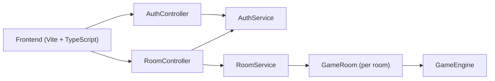
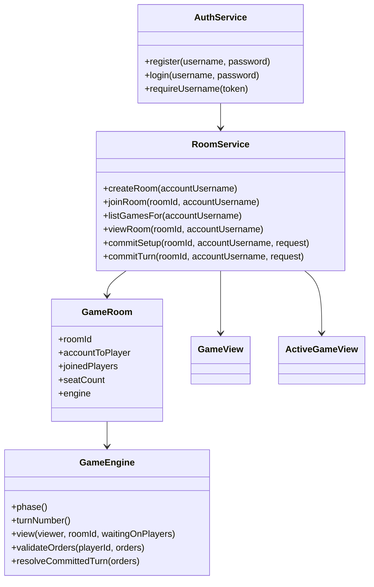
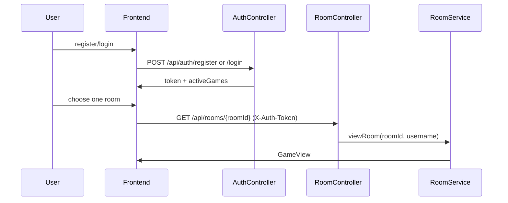
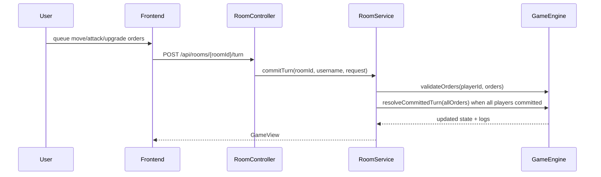

# Architecture

本文件对应 PJ2 当前实现，描述前后端结构、核心运行时对象，以及从账号登录到提交回合的主路径。

## Runtime

- `backend`: Spring Boot API on port `8080`
- `frontend`: Vite dev server on port `5173` during development
- 存储方式：当前账号、房间、游戏状态都保存在内存中；没有数据库依赖

## Component View

## Domain Model

## Frontend Responsibilities

- `frontend/src/main.ts`
  - 管理登录态、当前房间、active games 列表
  - 渲染 lobby/setup/orders/game over 全部主界面
  - 在浏览器本地预演 `MOVE` 的即时效果
  - 生成 `UPGRADE_TECH` / `UPGRADE_UNIT` / `MOVE` / `ATTACK` 请求
- `frontend/src/pj2Orders.ts`
  - 单位升级合法性与预计 technology cost
- `frontend/src/territoryIntel.ts`
  - 领地情报展示格式
- `frontend/src/turnSummary.ts` / `frontend/src/logSections.ts`
  - turn log 摘要与分组展示

## Backend Responsibilities

- `AuthController` / `AuthService`
  - 提供 `register` / `login` / `me`
  - 用 `X-Auth-Token` 把会话 token 映射回账号
- `RoomController` / `RoomService`
  - 处理房间创建、加入、查看、座位管理、setup、commit turn
  - 维护账号到房间席位的绑定关系
  - 返回 active games 列表，支持同账号多个房间
- `GameEngine`
  - 维护 territory、player、resources、unit levels、combat resolution
  - 执行 PJ2 food cost、technology upgrades、mixed-level combat

## Main Flows

### Login and return to a game

### Commit a turn

## Current Constraints

- 会话、房间、对局状态都在内存中，服务重启后会清空。
- 当前没有真实用户资料页或密码修改流程，只有最小登录能力。
- 课程交付以单机演示为主，因此没有引入数据库、消息队列或持久化事件流。

## Startup Order

1. Start backend with `mvn spring-boot:run`.
2. Wait for port `8080` to accept requests.
3. Start frontend with `npm run dev -- --host 127.0.0.1`.
