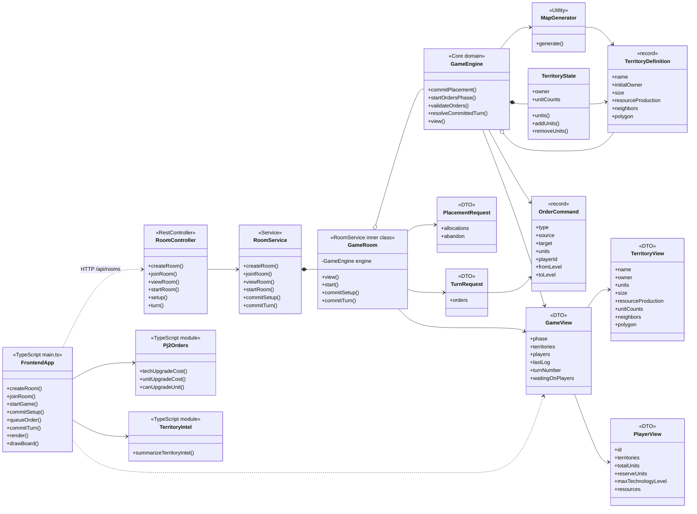

# PJ2 Phase 1 Key UML

This diagram keeps only the key classes/modules in the current `feature/pj2-phase1` implementation.

## Key Flow

`FrontendApp -> RoomController -> RoomService -> GameRoom -> GameEngine`

`GameEngine` is the core rule engine. It owns setup placement, order validation, resource costs, upgrades, combat resolution, reinforcements, and view generation.
