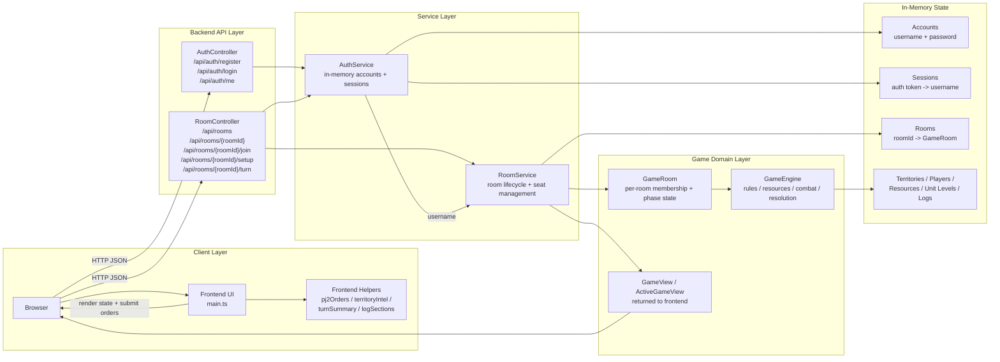

# System Architecture Diagram

这张图用于快速说明当前 PJ2 系统的整体结构、请求流向和核心运行时组件。

## Reading Guide

- 左侧是浏览器与前端 UI。
- 中间是 Spring Boot 暴露的认证和房间接口。
- 右侧是内存中的账号、房间和对局状态。
- 所有 PJ2 规则判定都落在 `GameEngine`，前端只做展示和本地提示。

## Key Points

- 身份体系：`AuthService` 用 `X-Auth-Token` 把会话映射到账号。
- 房间体系：`RoomService` 维护一个账号可加入多个 active games。
- 规则体系：`GameEngine` 负责 `food`、`technology`、升级、mixed-level combat 和 turn resolution。
- 持久化现状：当前实现没有数据库，服务重启后状态会清空。
